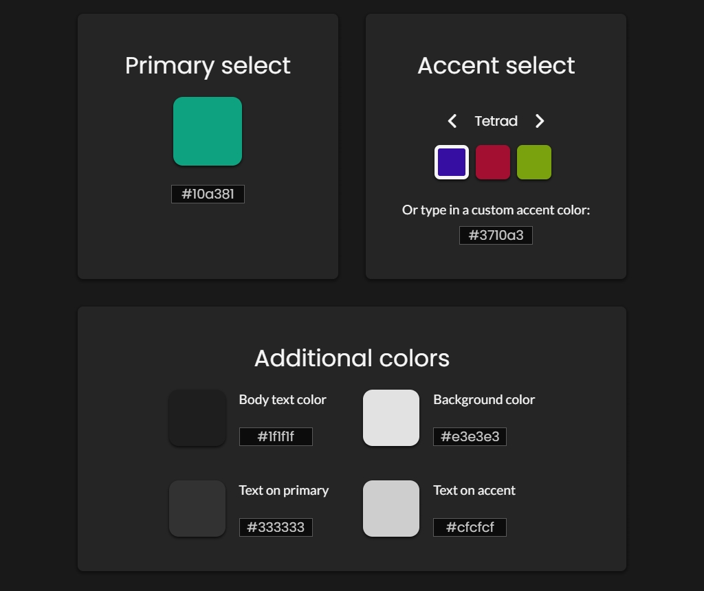
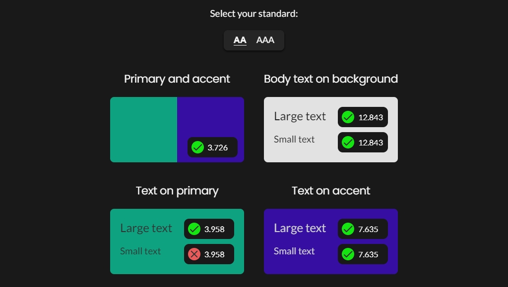
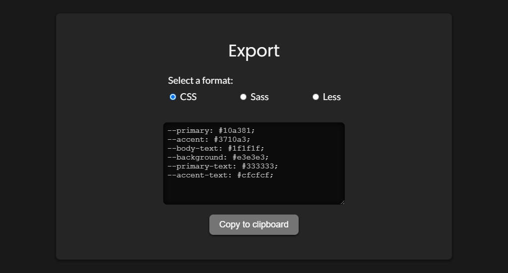

# Palette Contrast

## Introduction

A React page that tests the contrast in a simple web palette and returns a pass/fail state and the contrast ratio. Enter your color values and see if they pass the Web Content Accessibility Guidelines (WCAG) 2.1.

This project was bootstrapped with [Create React App](https://github.com/facebook/create-react-app).

## Features

-   An available list of accent colors complementary to your selected primary color
-   An option to select between Level AA or Level AAA contrast
-   Seven contrast tests, including non-text contrast, small text contrast, and large text contrast
-   Export function formatted in CSS, Sass, or Less

## Usage

### Color Selection

 

 

1.  Choose a primary color
2.  Select an accent color from a number of color schemes (or write in your own)
3.  Select a neutral background color and neutral text color
4.  Select a text on primary color
5.  Select a text on accent color

### Contrast Check

 

 

6.  Choose between Level AA or AAA contrast
7.  Check the contrast between a text color and its corresponding background color

### Export

 

 

8.  Export the color palette into CSS, Sass, or Less

## Tools and Libraries Used

-   [React](https://reactjs.org/)
-   [TinyColor](https://github.com/bgrins/TinyColor)
-   [styled-components](https://styled-components.com/)

## Resources

Read more about contrast requirements:

-   [Level AA Text Contrast](https://www.w3.org/WAI/WCAG21/Understanding/contrast-minimum.html)
-   [Level AAA Text Contrast](https://www.w3.org/WAI/WCAG21/Understanding/contrast-enhanced)
-   [Level AA Non-text Contrast](https://www.w3.org/WAI/WCAG21/Understanding/non-text-contrast)

## Available Scripts

In the project directory, you can run:

### `npm start`

Runs the app in the development mode. 
Open [http://localhost:3000](http://localhost:3000) to view it in the browser.

The page will reload if you make edits. 
You will also see any lint errors in the console.

### `npm test`

Launches the test runner in the interactive watch mode. 
See the section about [running tests](https://facebook.github.io/create-react-app/docs/running-tests) for more information.

### `npm run build`

Builds the app for production to the `build` folder. 
It correctly bundles React in production mode and optimizes the build for the best performance.

The build is minified and the filenames include the hashes. 
Your app is ready to be deployed!

See the section about [deployment](https://facebook.github.io/create-react-app/docs/deployment) for more information.

### `npm run eject`

**Note: this is a one-way operation. Once you `eject`, you can’t go back!**

If you aren’t satisfied with the build tool and configuration choices, you can `eject` at any time. This command will remove the single build dependency from your project.

Instead, it will copy all the configuration files and the transitive dependencies (webpack, Babel, ESLint, etc) right into your project so you have full control over them. All of the commands except `eject` will still work, but they will point to the copied scripts so you can tweak them. At this point you’re on your own.

You don’t have to ever use `eject`. The curated feature set is suitable for small and middle deployments, and you shouldn’t feel obligated to use this feature. However we understand that this tool wouldn’t be useful if you couldn’t customize it when you are ready for it.
